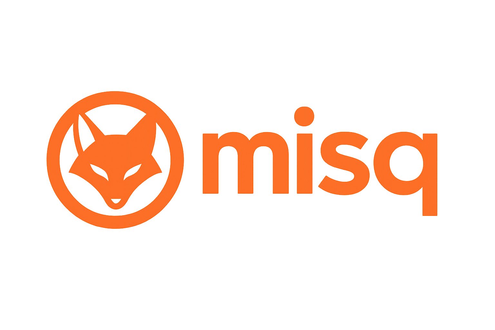

# Misq Mobile - *Bisq Companion Client*

<p align="center">
  <a href="https://bisq2.com/misq">
    
  </a>
  <br>
  <em>Private · Peer‑to‑Peer · Self‑Custodial</em>
  A full node capabable of running on your phone or by proxy of a secure machine doing the heavy work
</p>

---

Misq **Mobile** pairs with your **desktop Bisq or Haveno node** (formerly *Bisq or Bisq 2*) and brings trade notifications, offer browsing, and chat to your phone—without ever holding your private keys or coins, by design you can run a full or micro node on your phone, depends on it's spec.

> 🔗 **New here?** Read **[What is Bisq 2 / Misq?](https://misq.wiki/what_is_bisq.md)** to understand the architecture and security guarantees.

---

## 📚 Quick Links

| Topic                           | Wiki Page                                                         |
| ------------------------------- | ----------------------------------------------------------------- |
| **Desktop Installation**        | [Installing Misq (Desktop)](https://bisq2.com/installing_bisq)    |
| **Mobile Pairing Walk‑through** | [Pairing Mobile ↔ Desktop](https://bisq2.com/mobile/pairing)      |
| **Network Privacy & Tor Setup** | [Privacy Best Practices](https://bisq2.com/advanced/privacy)      |
| **Misq / Bisq Easy Protocol Flow**          | [Misq Spec](https://bisq2.com/misq/spec)              |
| **Full Roadmap**                | [Project Roadmap](https://bisq2.com/roadmap)                      |
| **Developer API**               | [HTTP API Reference](https://bisq2.com/developer/api/http)        |
| **FAQ**                         | [Misq FAQ](https://bisq2.com/advanced/misq-faq)                   |

---

## ✨ Features at a Glance

| Category                 | Mobile App                                                                            | Related Docs                                                         |
| ------------------------ | ------------------------------------------------------------------------------------- | -------------------------------------------------------------------- |
| **Trade Alerts**         | Push‑style notifications for every state change (offer taken, payment received, etc.) | [Trade Lifecycle](https://bisq2.com/trading/classic-workflow)     |
| **Offer Book**           | Browse + filter live offers pulled securely from your node                            | [Order Book Gossip](https://bisq2.com/developer/network/messages) |
| **Encrypted Chat**       | End‑to‑end chat synced with desktop                                                   | [P2P Messaging](https://bisq2.com/how_bisq_works.md#1-network-layer) |
| **Easy‑Protocol Trades** | Buy BTC with fiat instantly—no on‑chain deposit required                              | [Easy Quick Start](https://bisq2.com/misq/quick-start) |
| **DAO Snapshot**         | View proposals, vote phases, BSQ balance                                              | [DAO Overview](https://bisq2.com/dao/overview)                    |
| **Biometrics**           | Protect critical actions with fingerprint / Face ID                                   | (N/A)                                                                |
| **Tor / I2P Routing**    | Forces onion routing via Orbot/InviZible                                              | [Privacy Layer](https://bisq2.com/advanced/privacy)               |

---

## 🚀 Getting Started

### 1 · Prerequisites

* **Desktop Bisq or Haveno ** ≥ `2.0.0‑beta` running on your computer or server.
* **Tor relay** on mobile (Orbot recommended, i2p coming soon).
* Camera permission (for QR pairing).

### 2 · Install on Android

```bash
# Download & verify
wget https://github.com/your‑org/misq-mobile/releases/download/vX.Y.Z/MisqMobile‑universal.apk
wget https://github.com/your‑org/misq-mobile/releases/download/vX.Y.Z/SHA256SUMS
sha256sum -c SHA256SUMS --ignore‑missing

# Install
adb install MisqMobile‑universal.apk  # or tap in file manager
```

*(iOS TestFlight link announced on every GitHub release.)*

### 3 · Pair with Desktop

1. Desktop → **Settings › Remote API › Enable**.
2. Show QR → scan in mobile → success toast.

📖 **Detailed guide:** see **[Pairing Guide](https://bisq2.com/misq/pairing)**.

---

## 🛠️ Troubleshooting

| Symptom                      | Solution                                        | Wiki Ref                                                        |
| ---------------------------- | ----------------------------------------------- | --------------------------------------------------------------- |
| Tor bootstrap stuck at 10 %  | Switch Tor bridge via the novel Arti client     | [Tor Tips](https://bisq2.com/misq/advanced/privacy.md#tor-bootstrap) |
| No offers shown              | Desktop order book not synced → wait or restart | [Offer Sync](https://bisq2.com/misq/trading/offer-sync)           |
| QR scan fails                | Increase screen brightness; check camera perms  | N/A                                                             |
| Battery kills background Tor | Whitelist Orbot + Misq in battery settings      | [Mobile Tor](https://bisq2.com/misq/mobile/tor-tuning)            |

---

## 🔭 Roadmap Highlights

> Full list → **[Roadmap](https://bisq2.com/misq/roadmap)**

* **Multisig Trade Signing** — approve classic trades on‑the‑go.
* **Lightning & Liquid Swaps UI** — cross‑chain, instant settlement.
* **Watch‑Only Wallet** — monitor addresses, receive alerts.
* **Hardware‑Wallet Approvals** — FIDO2 / NFC tap‑to‑sign.

---

## 🤝 Contributing

1. Read **[Developer Onboarding](https://bisq2.com/developer/onboarding)**.
2. Fork → `git clone` → run `flutter run`.
3. Submit PRs with descriptive commits.

> Bug reports with full logs **beat** anonymous “it crashed” comments. ❤️

---

## ⚖️ License & Disclaimer

Misq Mobile is GPL‑3.

This app **does not custody assets** and merely pipes commands to your self‑hosted Misq node.  Always verify release signatures and understand the [trade‑off matrix](https://bisq2.com/bisq-vs-other-exchanges) before use.
